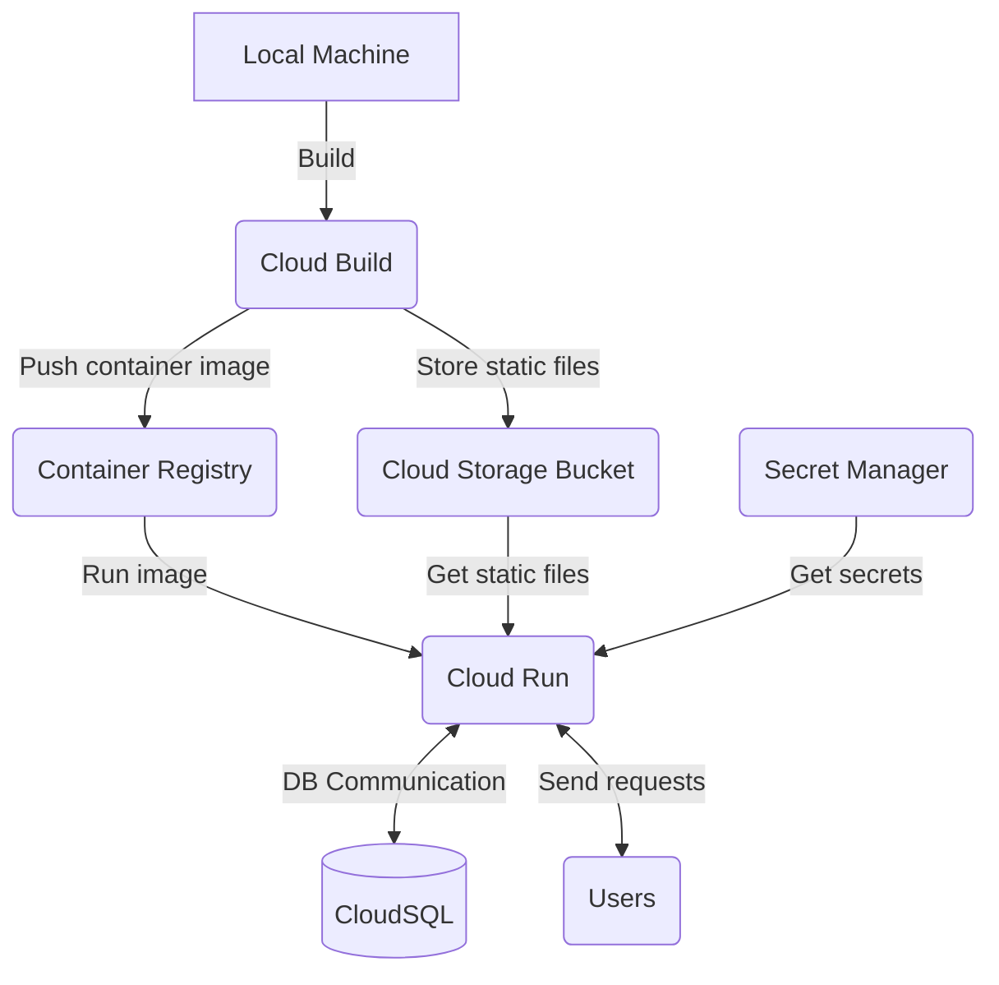

# IN3046 Group 8 - Cloud-based Wordle Game Application

## READMEs describing the UI and Backend

- [UI](cuol-wordle-ui/cuol_wordle_ui/README.md) - ReactJS w/ React Bootstrap and Redux Toolkit
- [Backend](cuol-wordle-backend/cuol_wordle_django/README.md) - python django

## Deployed on **GCP** using

- Cloud Run
- Cloud Build
- Cloud SQL
- Cloud Storage
- Container Registry
- Secret Manager

## Deployment chart

### Group Members

- Adam Kaczmarski
- Ayesha Kayani
- Vijay Kesireddy